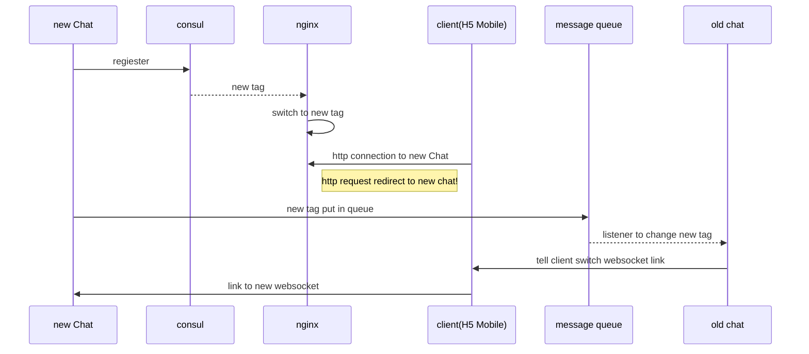

## 聊天室灰度發布

```mermaid
sequenceDiagram
  new Chat->> consul: regiester
  consul -->> nginx: new tag
  nginx->>nginx: switch to new tag
  client(H5 Mobile)->> nginx: http connection to new Chat
    Note right of nginx: http request redirect to new chat!
  new Chat->> message queue: new tag put in queue
  message queue -->> old chat: listener to change new tag
  old chat->> client(H5 Mobile): tell client switch websocket link
  client(H5 Mobile)->> new Chat: link to new websocket
```