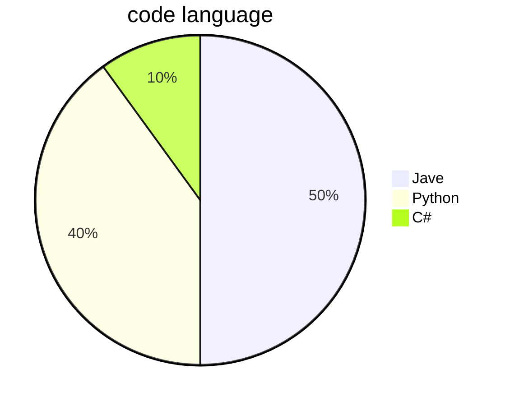
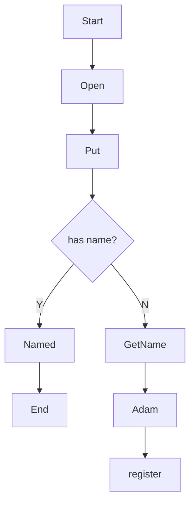
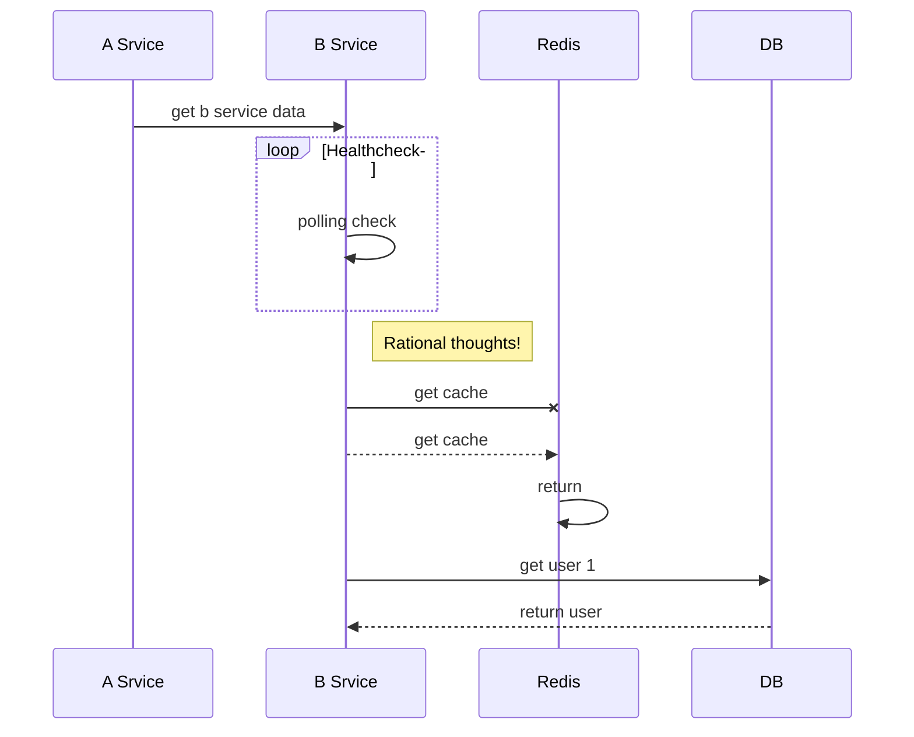
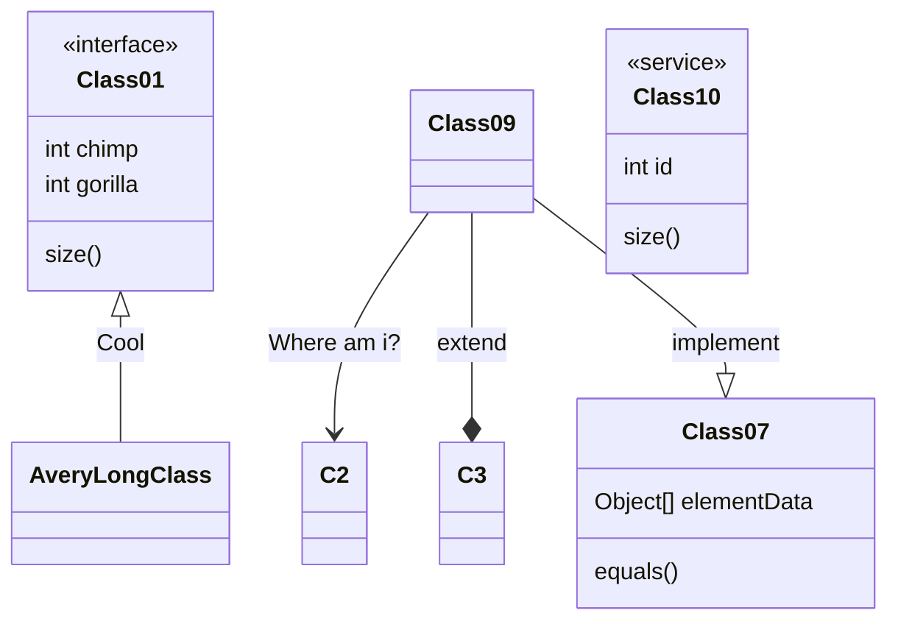

# Flow
原文 https://ithelp.ithome.com.tw/articles/10234553
https://mermaid-js.github.io/mermaid/#/

```mermaid
pie
title code language
"Jave" : 50
"Python" : 40
"C#" : 10
```

```mermaid
graph TB
    Start --> Open
    Open --> Put
    Put --> IsFit{"has name?"}
    IsFit -->|Y| Named
    Named --> End
    IsFit -->|N| GetName
    GetName --> Adam
    Adam --> register
```

```mermaid
sequenceDiagram
  A Srvice->>B Srvice: get b service data
  loop Healthcheck
      B Srvice->>B Srvice: polling check
  end
  Note right of B Srvice: Rational thoughts!
  B Srvice-xRedis: get cache
  B Srvice-->>Redis: get cache
  Redis ->> Redis: return
  B Srvice->>DB: get user 1
  DB-->>B Srvice: return user
```

```mermaid
classDiagram
  Class01 <|-- AveryLongClass : Cool
  <<interface>> Class01
  Class09 --> C2 : Where am i?
  Class09 --* C3 : extend
  Class09 --|> Class07 : implement
  Class07 : equals()
  Class07 : Object[] elementData
  Class01 : size()
  Class01 : int chimp
  Class01 : int gorilla
  class Class10 {
    <<service>>
    int id
    size()
  }
```