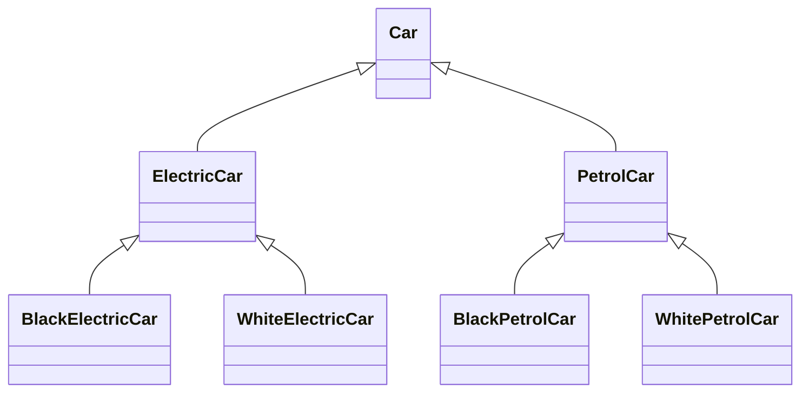
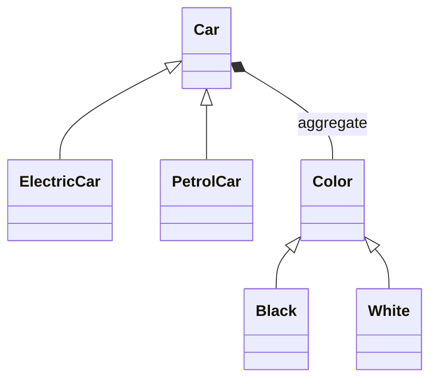

# [參考](https://www.cnblogs.com/jackion5/p/14323884.html)
#单一職责原则（Single Responsibitity Principle）
 - 當需要修改某個對象時，原因有且只有一個; 每個類或方法的職責只有一個
##Bad
職擇耦合度高，覆用性低
``` javascript
public class UserController {

    @RequestMapping(value = "regist")
    public String userRegist(String userName, String password) throws SQLException {

        if(StringUtils.isEmpty(userName)||StringUtils.isEmpty(password)){
            return "error";
        }
        
        Connection connection = DriverManager.getConnection("jdbc:mysql://localhost:3306/test","user","password");;
        String  sql = "";
        PreparedStatement preparedStatement = connection.prepareStatement(sql);

        preparedStatement.execute();
        return "success";
    }
}
```
##Good
職責抽哩，覆用性高
``` javascript
public interface UserService {

    public void addUser(String userName, String password);

}
public class UserController {
    @Resource
    private UserService userService;

    @RequestMapping(value = "regist")
    public String userRegist(String userName, String password) throws SQLException {
         checkParam(userName, password);

         userService.addUser(userName, password);
         return "success";
     }
 
     private void checkParam(String... params) {
 
     }
}
```
# 開放封閉原则（Open Close Principle）
 - 對拓展開放，對修改封閉
## Bad 
延展性低，條件特定，若要修改formate，即牽一髮而動全身
``` javascript
public static String formatDate(Date date){
    SimpleDateFormat format = new SimpleDateFormat("yyyy-MM-dd HH:mm:ss");
    return format.format(date);
}
```
1、若是進行中的專案，改由傳入formate格式，變成每個引用的地方都要調整
2、無法準確控制formate格式
``` javascript
public static String formatDate(Date date, String dateFormat){
    SimpleDateFormat format = new SimpleDateFormat(dateFormat);
    return format.format(date);
}
```
## Good
嚴格分類，開放所有類型接口，封閉所有formate的格式
``` javascript
public static String formatDate(Date date){
    SimpleDateFormat format = new SimpleDateFormat("yyyy-MM-dd");
    return format.format(date);
}

public static String formatTime(Date date){
    SimpleDateFormat format = new SimpleDateFormat("yyyy-MM-dd HH:mm:ss");
    return format.format(date);
}
```
# 里氏替换原则（Liskov Substitution Principle）
 - 一個子類實力在任何時刻都可以替換父類實例，從而形成is-a關係
``` javascript
public class UserCompare {

    private User user;

    public int compareUser(User otherUser){
        if(user.getUserId() > otherUser.getUserId()){
            return -1;
        }else if(user.getUserId() < otherUser.getUserId()){
            return 1;
        }else {
            return 0;
        }
    }

    public User getUser() {
        return user;
    }

    public void setUser(User user) {
        this.user = user;
    }
    
    public int getUpdateTime(HashMap<String, Integer> distance) {
        System.out.println("父類別執行");
        return(distance.get("distance")/flySpeed);
    }
}
```
## Bad
不該破壞父類，雖可滿足需求，但也遺失了父類原有提供的功能
``` javascript
public class StudentCompare extends UserCompare{
    @Override
    public int getUpdateTime(Map<String, Integer> distance) {
        System.out.println("子類別執行");
        return(distance.get("distance")/flySpeed);
    }
    
    @Override
    public int compareUser(User otherUser){
        if(user.getAge() > otherUser.getAge()){
            return -1;
        }else if(user.getAge() < otherUser.getAge()){
            return 1;
        }else {
            return 0;
        }
    }
}
```
## Good
 - 保留父類特性，延伸子類功能
 - getUpdateTime()的傳入參數改為Map。Map為HashMap的父類別，所以若重載父類的function，那傳入的參數範圍一定要比較大才行
``` javascript
public class StudentCompare extends UserCompare{
    
    public int getUpdateTime(Map<String, Integer> distance) {
        System.out.println("子類別執行");
        return(distance.get("distance")/flySpeed);
    }
    
    public int compareUserByAge(User otherUser){
        if(user.getAge() > otherUser.getAge()){
            return -1;
        }else if(user.getAge() < otherUser.getAge()){
            return 1;
        }else {
            return 0;
        }
    }
}
```
# 接口分離原则（Interface Segregation Principle）
 - 實現類不應該依賴不需要的接口方法，採用多個專用接口來替換單個複雜的接口
## Bad
不同類型的接口都寫在一起
``` javascript
public interface OrderService {

    /** 保存訂單 */
    public void addOrder();

    /** 查询訂單 */
    public void queryOrder();

    /** 支付 */
    public void payOrder();

    /** 退款*/
    public void refundOrder();
}
```
## Good
明確定義對應服務的Service
``` javascript
public interface OrderService {

    /** 保存訂單 */
    public void addOrder();

    /** 查询訂單 */
    public void queryOrder();
}

public interface PayService {
    /** 支付 */
    public void pay();

    /** 退款*/
    public void refundOrder();
}
```
# 依赖反轉原则（Dependence Inversion Principle）
 - 高層次的模組不應該依賴於低層次的模組，兩者都應該依賴於抽象介面
 - 抽象介面不應該依賴於具體實現。而具體實現則應該依賴於抽象介面
## Bad
接口參數直接依賴了拓展性較低的型態, ex: ArrayList, HashSet
``` javascript
public interface SortService {
    public void sortList(ArrayList list);
    public void sortSet(HashSet set);
}
```
## Good
使用較通用的型態，這樣ArrayList, LinkedList都可使用
``` javascript
public interface SortService {
    public void sortList(List list);
    public void sortSet(Set set);
}
```
 [參考](https://blog.csdn.net/zhengzhb/article/details/7289269)
## Bad
``` javascript
class Book{
    public String getContent(){
        retrun "long long ago";
    }
}
class Mother{
    public void narrate(Book book){
        System.out.println("tall story");
        System.out.println(book.getContent());
    }
}
public class Client{
    public static void main(String[] args){
        var mother = Mother();
        mother.narrate(new Book());
    }
}
```
## Good
``` javascript
interface IReader{
    public String getContent();
}

class Book implements IReader{
    public String getContent(){
        retrun "long long ago";
    }
}
class Mother{
    public void narrate(IReader reader){
        System.out.println("tall story");
        System.out.println(reader.getContent());
    }
}
public class Client{
    public static void main(String[] args){
        var mother = Mother();
        mother.narrate(new Book());
    }
}
```
# 迪米特法则（Law Of Demter）
 - 各單元對其他單元所知應當有限：只瞭解與目前單元最相關之單元
``` javascript
public class Department {
    private String deptName;

    private List<Employee> employeeList;

    public void sendNotice() {
        for(Employee employee : employeeList){
            System.out.println("发送通知给:" + employee.getUserName());
        }
    }
    ... get set
}
```
## Bad
要向各部門所有成員發通知，應該是通知部門，而無須去轉底下人員，對彼此的了解到部門即可
``` javascript
public class Company {
    private String companyName;

    private List<Department> departmentList;

    /** 发送通知 */
    public void sendNotice(){
        for (Department department : departmentList){
            List<Employee> employeeList = department.getEmployeeList();
            for(Employee employee : employeeList){
                System.out.println("发送通知给:" + employee.getUserName());
            }
        }
    }
    ... get set
}
```
## Good
``` javascript
public class Company {

    private String companyName;

    private List<Department> departmentList;

    /** 发送通知 */
    public void sendNotice(){
        for (Department department : departmentList){
            department.sendNotice();
        }
    }
    ... get set
}

```

#合成/聚合覆用原则（Composite/Aggregate Reuse Principle，CARP）
[參考](https://ithelp.ithome.com.tw/articles/10236782)
## Bad

## Good

``` javascript
interface Color {  // 抽出來建立介面
      void kind();
}
abstract class Car {
     Color color;  // 做合成
     abstract void run();
     public Color getColor() {
        return color;
     }
     public void setColor(Color color) {
        this.color = color;
     }
}

class ElectricCar extends Car {
    @Override
    void run() {
        System.out.println("電動車");
    }
}
class PetrolCar extends Car {
    @Override
    void run() {
        System.out.println("汽油車");
    }
}
class White implements Color{
    @Override
    public void kind() {
        System.out.println("白色");
    }
}
class Black implements Color{
    @Override
    public void kind() {
        System.out.println("黑色");
    }
}

public class MyCar {
    public static void main(String args[]) {
        ElectricCar electricCar = new ElectricCar();
        White color = new White();
        electricCar.setColor(color);
        electricCar.getColor().kind();
        electricCar.run();
    }
}
```