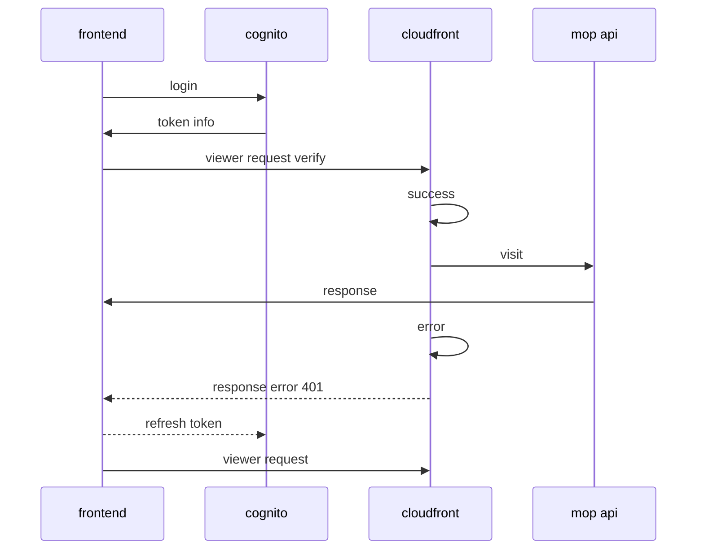

## refresh token

```mermaid
sequenceDiagram
  frontend->> cognito: login
  cognito->> frontend: token info
  frontend->> cloudfront: viewer request verify
  cloudfront->> cloudfront: success
  cloudfront->> mop api: visit
  mop api->> frontend: response
  cloudfront->> cloudfront: error
  cloudfront-->> frontend: response error 401
  frontend-->> cognito: refresh token
  frontend->> cloudfront: viewer request
```